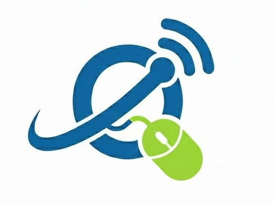

<p align="center">
  
</p>

<h1 align="center">QasiNet — Automated Airtime & Data Bundles Platform</h1>

<p align="center">
  <strong>Enterprise-grade, high-availability telecom vending and automated M-Pesa payment engine in Kenya.</strong>
</p>

<p align="center">
  <a href="https://qasinet.com"></a>
  <a href="https://wa.me/254722647928"></a>
  <a href="mailto:sanaregeorge48@gmail.com"></a>
</p>

<p align="center">
  
  
  
  
  
  
</p>

---

## 📌 Executive Summary

**QasiNet** ([qasinet.com](https://qasinet.com)) is a fintech and telecommunications reselling platform engineered for **instant, 24/7 automated delivery** of airtime and high-speed data bundles across Kenyan mobile networks.

By directly interfacing with **Safaricom M-Pesa Daraja (STK Push & C2B Paybill)**, the **Bingwa Sokoni Reseller API**, and upstream telecom gateways, QasiNet automates the entire order lifecycle: from payment collection and financial verification to automated bundle vending, customer status tracking, and digital receipt dispatch.

---

## ⚡ Live Services Offered

| Network / Category | Service | Delivery Mechanism |
| :--- | :--- | :--- |
| **Safaricom** | Airtime Top-Up (KES 5 – KES 10,000) | Instant STK / Automated Kyanda Vending |
| **Airtel** | Airtime Top-Up (KES 10 – KES 10,000) | Instant Automated Vending |
| **Telkom** | Airtime Top-Up (KES 10 – KES 10,000) | Instant Automated Vending |
| **Equitel** | Airtime Top-Up (KES 10 – KES 10,000) | Instant Automated Vending |
| **Faiba 4G** | Airtime Top-Up (KES 10 – KES 10,000) | Instant Automated Vending |
| **Faiba Data** | High-Speed 4G Bundles (1GB, 8GB, 25GB, 40GB, Unlimited) | Instant Direct Vending (`FAIBA_B`) |
| **Bingwa Sokoni (Safaricom)** | Discount Bundles (Daily, Weekly, Monthly) | Bingwa Sokoni Reseller Till API |
| **Bingwa Sokoni (Airtel)** | Cheap Data Bundles & Heavy Surfing Packs | Bingwa Sokoni Reseller Till API |

> 🔗 **Explore live bundles:** [https://qasinet.com/services](https://qasinet.com/services)

---

## 🚀 Key Features & Architectural Highlights

### 1. Dual M-Pesa Payment Flow
- **Direct STK Push**: Customer enters phone number and amount; an instantaneous M-Pesa prompt appears on their phone requesting their M-Pesa PIN.
- **Paybill C2B Self-Describing Orders**: Customers can pay directly to the QasiNet Paybill with structured account reference codes (e.g. `2GB*0712345678` or `1.25GB`). The system parses the reference, identifies the target bundle and recipient, and executes the vending order within seconds.

### 2. State Machine & Autonomous Reconciliation
- Built around a strict, tamper-proof state machine:
  ```
  [CREATED] ──► [PAYMENT_PENDING] ──► [PAYMENT_CONFIRMED] ──► [VENDING_PENDING] ──► [SUCCESS]
                                             │
                                             └──► [VENDING_FAILED_REFUND_PENDING]
  ```
- **Refund Safety Net**: In the rare event of upstream provider downtime, transactions automatically transition to `VENDING_FAILED_REFUND_PENDING`. Immediate email notifications are dispatched to both the customer and admin with all transaction hashes.
- **Float Pre-Check & Circuit Breaker**: Real-time balance verification prevents customer checkout initiation if upstream merchant wallet float is depleted.

### 3. Live Order Tracking & Customer Verification
- Dedicated order tracker at [qasinet.com/track](https://qasinet.com/track).
- Strictly verifies order ownership against the customer phone number before exposing transaction metadata or tokens, preventing telephone enumeration and privacy leakage.

### 4. Progressive Web App (PWA) & Offline Resiliency
- Installable on Android, iOS, Windows, and macOS.
- Built-in service worker and offline queue manager that caches pending orders and replays them with idempotency locks once internet connectivity resumes.

### 5. Automated Transaction Receipts
- Instant digital receipts generated and dispatched using the **Resend** transactional email infrastructure, with HTML email templates and delivery telemetry.

---

## 🛡️ Enterprise Security & Hardening

QasiNet has been fortified following industry-standard financial and OWASP security practices:

* **Row Level Security (RLS)**: Enforced across all Supabase PostgreSQL tables (`admins`, `system_settings`, `payments`, `transaction_events`, `kyanda_transactions`, and `webhook_events`). Public anon keys are strictly prohibited from reading backend configs or provider credentials.
* **HTTP Security Headers**: Configured in Next.js 16 with a strict Content Security Policy (CSP), `X-Frame-Options: DENY` (anti-clickjacking), `X-Content-Type-Options: nosniff`, `Referrer-Policy: strict-origin-when-cross-origin`, and HSTS preload.
* **Next.js 16 Proxy / Middleware API Protection**: Guarantees that all `/admin` and `/api/admin/*` routes reject unauthorized requests with structured JSON `401` / `403` status codes.
* **Locked Test Endpoints**: Public test routes (`/api/test-daraja`, `/api/test-kyanda`) automatically return `404 Not Found` in production to prevent unauthorized balance checking or accidental float depletion.
* **Webhook Authentication**: Bearer token and secret verification (`BINGWA_WEBHOOK_SECRET`, `MPESA_C2B_SECRET`) safeguard asynchronous callbacks against request forging.
* **Anti-Abuse Rate Limiting**: Multi-proxy client IP extraction with token-bucket rate limiting applied to checkout, tracking, and OTP request endpoints.

---

## 🛠️ Technology Stack

```
Frontend:          Next.js 16.3.4 (App Router, Turbopack), React 19, TypeScript, Vanilla CSS
Backend:           Next.js Route Handlers, Next.js 16 Proxy Middleware, Zod Validation
Database & Auth:   Supabase (PostgreSQL, Row Level Security, Realtime, Auth)
Payments:          Safaricom M-Pesa Daraja API (STK Push, C2B Paybill Ingestion)
Telecom Vending:   Bingwa Sokoni Reseller Till API, Kyanda Telecommunications API
Email:             Resend API (Transactional Receipts & Admin Alerts)
Testing:           Vitest (204 automated unit and integration tests passing)
Hosting:           Vercel (Edge Network, CI/CD automated deployments)
SEO & Discovery:   Dynamic Sitemap, Google Search Console Verified, Semantic Schema.org
```

---

## 🏗️ Getting Started Locally

### Prerequisites
- Node.js 20.x or higher
- npm or pnpm
- Supabase account & project

### 1. Clone the Repository
```bash
git clone https://github.com/expertsocial/Qasinet.git
cd Qasinet
```

### 2. Install Dependencies
```bash
npm install
```

### 3. Setup Environment Variables
Copy the configuration template:
```bash
cp .env.example .env.local
```
Fill in your credentials in `.env.local`:
- `NEXT_PUBLIC_BASE_URL`
- `NEXT_PUBLIC_SUPABASE_URL` & `NEXT_PUBLIC_SUPABASE_ANON_KEY`
- `SUPABASE_SERVICE_ROLE_KEY`
- `MPESA_CONSUMER_KEY`, `MPESA_CONSUMER_SECRET`, `MPESA_PASSKEY`
- `BINGWA_SOKONI_TILL`, `BINGWA_SOKONI_API_KEY`, `BINGWA_SOKONI_BASE_URL`
- `RESEND_API_KEY`
- `CRON_SECRET`

### 4. Run the Test Suite
```bash
npx vitest run
```
*All 204 unit and integration tests will execute against mocked and sandbox providers.*

### 5. Start Development Server
```bash
npm run dev
```
Open [http://localhost:3000](http://localhost:3000) to view the application.

---

## 👨‍💻 Built & Engineered By: George Sanare

<table align="center">
  <tr>
    <td align="center">
      
      <br />
      <strong>George Sanare</strong>
      <br />
      <em>Full-Stack Software Engineer & Fintech Systems Architect</em>
      <br />
      Nairobi, Kenya 🇰🇪
    </td>
  </tr>
</table>

### 📬 Direct Contact Information
- **WhatsApp / Phone**: [**+254 722 647 928**](https://wa.me/254722647928) *(Quickest response)*
- **Email**: [**sanaregeorge48@gmail.com**](mailto:sanaregeorge48@gmail.com)
- **GitHub**: [@expertsocial](https://github.com/expertsocial)
- **Portfolio / Live System**: [https://qasinet.com](https://qasinet.com)

---

## 💼 Work With Me — Custom Software & Web Development

Looking for a seasoned engineer to build your next digital product? I design and develop production-ready, revenue-generating software for businesses across Kenya and worldwide:

### 1. 🌟 High-Converting Landing Pages & Business Websites
- **Tailored for**:
  - **Beauty Salons, Barbershops & Spas** (with automated appointment booking)
  - **Hotels, Airbnbs & Lodges** (with room showcase & booking engines)
  - **Advocates, Law Firms & Consultancies** (trust-building legal portfolios)
  - **Medical Clinics & Healthcare Providers**
  - **Corporate & Startup Landing Pages**
- **Features**: Blazing-fast page load times, glassmorphic & modern aesthetics, mobile-first design, SEO-optimized to rank on Google Search.

### 2. 🛒 Reliable POS (Point of Sale) & Inventory Systems
- Intuitive, bulletproof POS applications for retail shops, supermarkets, liquor stores, and restaurants.
- **Features**: Real-time inventory tracking, receipt thermal printing, barcode scanner support, daily profit & loss reporting, role-based cashier logins, and offline-first capabilities.

### 3. ⚡ Custom Telecom, M-Pesa & Fintech Integrations
- Seamless integration of Safaricom M-Pesa (STK Push, C2B Paybill, B2C Disbursals, B2B).
- Automated airtime, electricity token (KPLC), and data vending bots.
- Automated SMS alert engines and bulk notification systems.

---

<p align="center">
  <a href="https://wa.me/254722647928">
    
  </a>
  &nbsp;&nbsp;
  <a href="mailto:sanaregeorge48@gmail.com">
    
  </a>
</p>

---

<p align="center">
  <sub>© 2026 QasiNet Ltd. All Rights Reserved. Engineered with precision by George Sanare.</sub>
</p>
