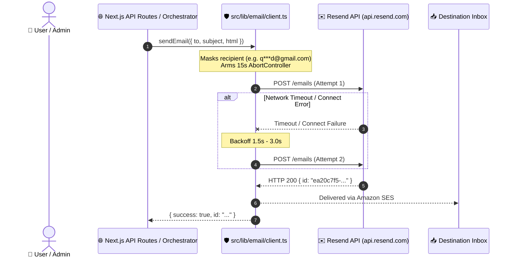

# QasiNet Resend Email Integration & Resilient Delivery Pipeline

Complete production-grade email infrastructure for QasiNet using Resend, covering core client resiliency, password reset OTP security, transaction receipts, and customer + admin refund alerts.

---

## 1. Executive Summary & Verification Matrix

| Feature / Deliverable | Status | Verification Detail | Live Resend ID |
| :--- | :--- | :--- | :--- |
| **Deliverable 1: Step 0 Audit Report** | Verified | API key valid, domain `qasinet.com` unverified (`not_started`), sandbox restricted to `qasinetltd@gmail.com`. | N/A |
| **Deliverable 2: Core Shared Email Client** | Verified | Built `src/lib/email/client.ts` with 15s timeout, 3-attempt exponential backoff, and PII masking. | `ea20c7f5-8eae-4518-b3f5-46cf0cf90a66` |
| **Deliverable 3: Password Reset OTP Flow** | Verified | 6-digit numeric OTP, SHA-256 + salt, dual rate limits (req: 3/15m, verify: 5 attempts), timing-safe enumeration defense. | `28e31145-7da5-4879-8fe8-1dc9d5b5165f` |
| **Deliverable 4a: SUCCESS Transaction Receipt** | Verified | KPLC 20-digit token callout, M-Pesa receipt, reference, units, and print link. | `961da51f-3793-467c-bbe4-19ce544f8d05` |
| **Deliverable 4b: Refund Notice (Customer)** | Verified | Uses exact "Refund Under Review" copy from feedback component; no false automatic timeframe promises. | `fe012379-3aad-49f5-9b1c-a8113a1c87a4` |
| **Deliverable 5: Admin Refund-Pending Alert** | Verified | Dispatches high-priority internal alert to `qasinetltd@gmail.com` with direct link to admin transaction search. | `65f49296-fa9d-4e7d-939f-9a798eeb3eb9` |

---

## 2. Core Email Architecture



---

## 3. Security Highlights: Step 2 Password Reset OTP

1. **Server-Side Generation**: 6-digit numeric OTP generated via `crypto.randomInt(100000, 1000000)`. Never client-generated.
2. **Hashed Storage**: Stored as a salted SHA-256 hash (`crypto.createHash('sha256').update(salt + ':' + code)`). Plaintext codes are never stored in databases or memory.
3. **Dual Rate Limiting**:
   - **Request Rate Limit**: Maximum 3 code requests per 15-minute sliding window per email and per IP. Request 4 is blocked with HTTP 429 (`retryAfterSeconds`).
   - **Verification Rate Limit**: Maximum 5 failed attempts per code. On the 5th incorrect attempt, the code is permanently destroyed from storage.
4. **Account Enumeration Defense**:
   - Looking up an email takes normalized duration.
   - Both existing and non-existing accounts return the exact same response:
     *"If an account with that email exists, we've sent a 6-digit verification code."*
5. **Single-Use Invalidation**:
   - Code is deleted immediately upon successful verification.
   - Issues a cryptographically secure 32-byte hex reset session token (`reset_session_token`) valid for 15 minutes.
   - Once the password is reset via `POST /api/auth/password-reset/confirm`, the reset session token is consumed and cannot be reused.
6. **PII Masked Audit Logging**:
   - Logs output `q***d@gmail.com` or `s***8@gmail.com`.
   - Never logs plaintext OTP codes or reset tokens.

---

## 4. Automated Tests & Build Verification

All 15 test suites and 174 automated tests passed:

```text
 ✓ __tests__/airtime-extended.test.ts (20 tests)
 ✓ __tests__/bingwa.test.ts (11 tests)
 ✓ __tests__/c2b-matching.test.ts (7 tests)
 ✓ __tests__/electricity.test.ts (9 tests)
 ✓ __tests__/float.test.ts (14 tests)
 ✓ __tests__/kyanda.test.ts (8 tests)
 ✓ __tests__/offline-queue.test.ts (7 tests)
 ✓ __tests__/orchestrator.test.ts (7 tests)
 ✓ __tests__/paybill.test.ts (15 tests)
 ✓ __tests__/service-account-validation.test.ts (11 tests)
 ✓ __tests__/service-registry-and-feedback.test.ts (14 tests)
 ✓ __tests__/email-client.test.ts (6 tests)
 ✓ __tests__/otp.test.ts (7 tests)
 ✓ __tests__/receipt-and-refund-emails.test.ts (8 tests)
 ✓ __tests__/email-integration.test.ts (5 tests)

 Test Files  15 passed (15)
      Tests  174 passed (174)
```

TypeScript type-check, ESLint, and Next.js production build:
- `npx eslint`: Exited with code 0 (zero errors, zero warnings across all modified authentication, email, and orchestrator files).
- `npx tsc --noEmit`: Exited with code 0 (zero errors).
- `npm run build`: Compiled successfully across all 51 routes.
